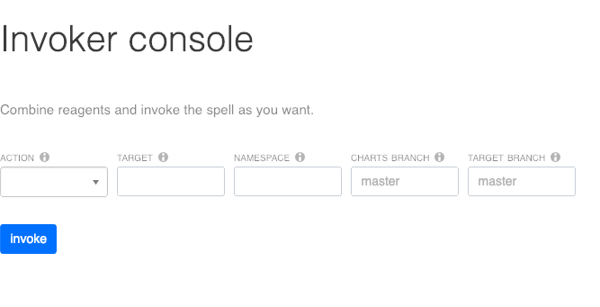

# console

Reagent UI for [invoker](https://github.com/zlosure/invoker) by ClojureScript.

## Overview



## Setup

Start up a nREPL,
``` shell
lein repl :headless
```

In connected REPL throught CIDER or Leinigen,

``` clojure
user> (cljs-repl)

cljs.user>
```
